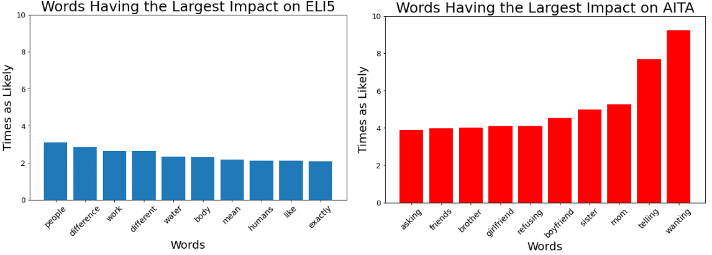

# Problem Statement

The Gardner Newspaper Company has recently opened an advice column in their weekly newsletter. The public response has been overwhelming and they have been inundated with questions. To accommodate this increased volume, Gardner Newspaper Company created two separate groups: one to answer interpersonal questions, and another to explain technical concepts simply.

Our consulting group was tasked with creating an algorithm to transfer the questions to the correct team.

# Dataset

The data analyzed was collected from two separate subreddits, [Explain Like I'm 5](https://www.reddit.com/r/explainlikeimfive/) and [Am I the Asshole](https://www.reddit.com/r/AmItheAsshole/), using Pushshift's [API](https://github.com/pushshift/api). 5200 posts were collected from each subreddit for a total of 10400 posts. Data dictionary is shown [below](#Data-Dictionary)

# Executive Summary

A CountVectorizer was used to turn each post's title into individual words. These token words were then utilized in multiple different models to try a create the most accurate prediction of which subreddit the post came from. A multinomial naive bayes model was the single model that gave the most accurate prdictions of the data. However, when the naive bayes model was ensembled with a logistic regression and a support vector machine model using the vote classifier model, the prediction became even better. Below is an image showing the ten most impactful words for each subreddit when predicting using the logistic regression.

Using the voting classifier to create an ensemble model for predicting subreddit resulted in a 97% accurate for the training data and 93% for the testing data.

# Conclusions

* An ensemble model was created which takes in Multnomial Naive Bayes, Logistic Regression, and Support Vector Machine to generate predictions
* The model correctly predicts the sale price of around 93% of the subreddits posts based only on the title text
* The model struggles to correctly identify technical questions based on personal concepts ( ie sex, kids, marriage)

## Next Steps

* Look into creating a subsequent model which uses additional question text instead of just title to provide more predictive power especially for technical questions
* Determine the functionality of this model in different subreddits and see if it is possible to predict additional subreddits which ask questions

# Data Dictionary

|
Feature|
Type|
Description|
| --- | --- | --- |
|
Subreddit|
Discrite|
Where each post comes from - Either AmItheAsshole or ExplainLikeIm5|
|
Post Title Text|
String|
The text of each post's title|
